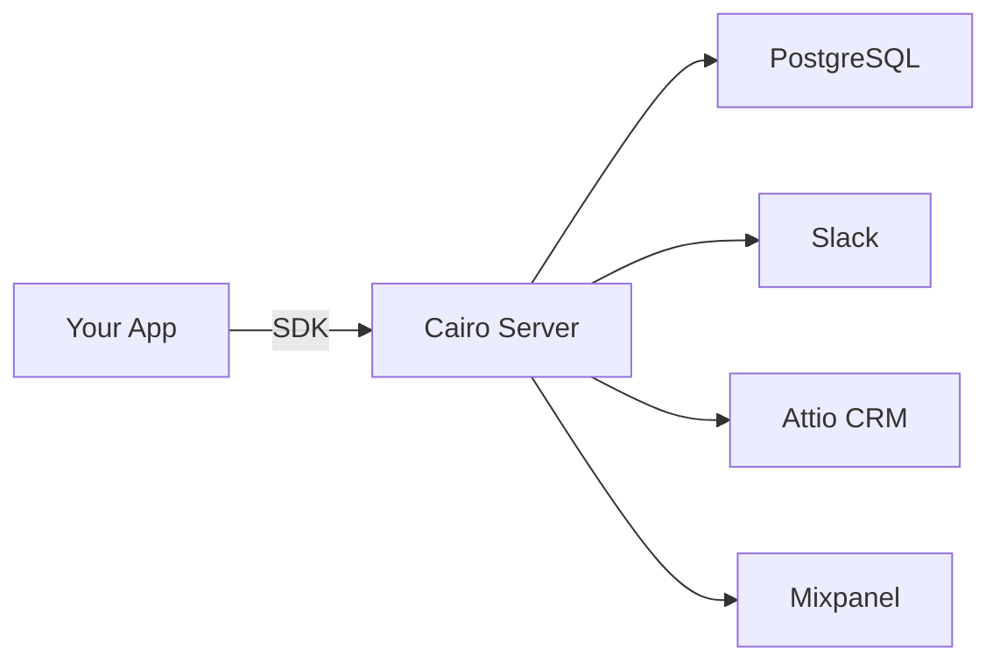

# Cairo SDK Quick Start Guide

## 🚀 Overview

Cairo now provides powerful SDKs to track events from your Node.js and Next.js applications. Send versatile events that automatically:
- 📊 Get logged to the database
- 💬 Trigger Slack notifications
- 🔄 Sync to Attio CRM
- 📈 Push to Mixpanel analytics

## Installation

### Node.js / Next.js

```bash
npm install @cairo/node-sdk
```

## Basic Setup

### 1. Initialize the SDK

```javascript
const Cairo = require('@cairo/node-sdk');

const cairo = Cairo.init('YOUR_WRITE_KEY', {
  dataPlaneUrl: 'http://localhost:8080', // Your Cairo instance
  flushAt: 20,          // Batch size
  flushInterval: 10000  // Batch interval (ms)
});
```

### 2. Track Events

```javascript
// Simple event tracking
cairo.track('Button Clicked', {
  button: 'signup',
  page: 'landing'
});

// With user context
cairo.track({
  userId: 'user-123',
  event: 'Product Purchased',
  properties: {
    productId: 'PRO-001',
    price: 99.99,
    currency: 'USD'
  }
});
```

### 3. Identify Users

```javascript
cairo.identify('user-123', {
  email: 'john@example.com',
  name: 'John Doe',
  plan: 'premium',
  company: 'Acme Corp'
});
```

## Server API Endpoints

The SDK communicates with these Cairo server endpoints:

| Endpoint | Method | Description |
|----------|--------|-------------|
| `/v2/batch` | POST | Batch multiple events |
| `/v2/track` | POST | Single event tracking |
| `/v2/identify` | POST | User identification |
| `/v2/page` | POST | Page view tracking |
| `/v2/group` | POST | Group association |
| `/v2/alias` | POST | User aliasing |

## Event Flow



## Configuration

### Environment Variables

Configure your Cairo server with:

```env
# For Slack notifications
SLACK_WEBHOOK_URL=https://hooks.slack.com/services/...
SLACK_ALERT_EVENTS=signup,purchase,subscription
SLACK_DEFAULT_CHANNEL=#events

# For Attio sync
ATTIO_API_KEY=your-attio-key

# For Mixpanel
MIXPANEL_PROJECT_TOKEN=your-project-token
```

### SDK Authentication

Get your write key from the Cairo dashboard (coming soon) or use any string for now:

```javascript
const cairo = Cairo.init('your-write-key', {
  // options
});
```

## Example: E-commerce Tracking

```javascript
// Track user journey
async function trackPurchaseFlow(userId, cartItems) {
  // User views product
  cairo.track({
    userId,
    event: 'Product Viewed',
    properties: {
      productId: cartItems[0].id,
      productName: cartItems[0].name,
      price: cartItems[0].price
    }
  });

  // User adds to cart
  cairo.track({
    userId,
    event: 'Add to Cart',
    properties: {
      cartValue: cartItems.reduce((sum, item) => sum + item.price, 0),
      itemCount: cartItems.length
    }
  });

  // User completes purchase
  cairo.track({
    userId,
    event: 'Purchase Completed',
    properties: {
      orderId: 'ORD-12345',
      revenue: cartItems.reduce((sum, item) => sum + item.price, 0),
      products: cartItems.map(item => item.id)
    }
  });

  // Flush events immediately
  await cairo.flush();
}
```

## Next.js Integration

### API Route Example

```javascript
// pages/api/track.js
import Cairo from '@cairo/node-sdk';

const cairo = Cairo.init(process.env.CAIRO_WRITE_KEY);

export default async function handler(req, res) {
  const { event, properties } = req.body;
  const userId = req.session?.userId || req.cookies.anonymousId;

  cairo.track({
    userId,
    event,
    properties
  });

  res.json({ success: true });
}
```

### Server-Side Props

```javascript
// pages/product/[id].js
export async function getServerSideProps({ params, req }) {
  const cairo = require('@cairo/node-sdk').getInstance();

  // Track server-side page view
  cairo.page({
    userId: req.cookies.userId,
    name: 'Product Detail',
    properties: {
      productId: params.id,
      referrer: req.headers.referer
    }
  });

  return {
    props: { productId: params.id }
  };
}
```

## Testing Your Integration

1. **Start Cairo server:**
```bash
npm run dev
```

2. **Run the demo:**
```bash
node examples/node-sdk-demo.js
```

3. **Check the logs:**
- Server logs will show incoming events
- Database will have new records in `event_source` table
- Slack will receive notifications (if configured)

## TypeScript Support

The SDK includes full TypeScript definitions:

```typescript
import Cairo, { TrackMessage, CairoConfig } from '@cairo/node-sdk';

const config: CairoConfig = {
  writeKey: 'your-key',
  dataPlaneUrl: 'https://api.cairo.io',
  debug: true
};

const cairo = Cairo.init(config.writeKey, config);

const event: TrackMessage = {
  userId: 'user-123',
  event: 'Subscription Started',
  properties: {
    plan: 'premium',
    price: 29.99
  }
};

cairo.track(event);
```

## Debugging

Enable debug mode to see detailed logs:

```javascript
const cairo = Cairo.init('YOUR_KEY', {
  debug: true
});
```

## Best Practices

1. **Always identify users after login:**
```javascript
cairo.identify(user.id, {
  email: user.email,
  name: user.name
});
```

2. **Use consistent event naming:**
```javascript
// Good: PascalCase for events
cairo.track('User Signed Up', {...});
cairo.track('Payment Completed', {...});

// Bad: Inconsistent naming
cairo.track('user_signup', {...});
cairo.track('payment-done', {...});
```

3. **Flush on app shutdown:**
```javascript
process.on('SIGTERM', async () => {
  await cairo.flush();
  process.exit(0);
});
```

## What's Next?

- ✅ Node.js SDK (Complete)
- ⏳ React SDK with hooks (Coming soon)
- ⏳ Browser JavaScript SDK (Coming soon)
- ⏳ Configuration UI (Coming soon)
- ⏳ More destinations (Coming soon)

## Support

- GitHub: [https://github.com/cairo-cdp/cairo](https://github.com/cairo-cdp/cairo)
- Docs: Check `/docs` folder
- Issues: Open a GitHub issue